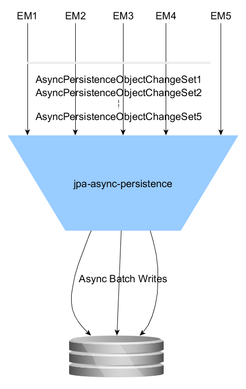

###jpa-eclipselink

In software development modularization is the key as it encourages reusability. But if we use framework like Spring, it
posses a challenge as we have to configuer the beans or add package scanning path. Hence it cannot be termed as true module.
This project (**jpa-eclipselink**) provides a technique to overcome this challenge by using Spring autoconfigure feature. So basically, by 
just adding pom.xml dependency,automatically all the JPA/Eclpselink will configured. 

The goal of this lib is to auto configure EclipseLink/JPA configurations. This Spring Boot auto configurer lib will
auto configure:
1. Entity Manager factory (a bean with name entityManagerFactory)
2. JPA transaction manager (a bean with name transactionManager)
3. Auto configure datasource
4. Auto scanning of entities (@EntityScan)
5. JPA configuration without persistence.xml
6. Auto configure JPA/EclipseLink best practices, explained below in detail
7. Reactive/Async Persistence

Including this lib will bring Spring Data features automatically. 

#####Auto configure JPA/EclipseLink best practices explain below in detail**

1. **eclipselink.cache.shared.default** - By default EclipseLink maintains a shared 2nd level object cache. This
   normally is a good thing, and improves read performance significantly. 
   
2. Many databases provide an optimization that allows a batch of write operations to be performed as a single database 
   access. There is both parametrized and dynamic batch writing. For parametrized batch writing a single parametrized 
   SQL statement can be executed with a batch of parameter vales instead of a single set of parameter values. This is 
   very optimal as the SQL only needs to be executed once, and all of the data can be passed optimally to the database.
   
   Dynamic batch writing requires dynamic (non-parametrized) SQL that is batched into a single big statement and sent to
   the database all at once. The database then needs to process this huge string and execute each statement. This 
   requires the database do a lot of work parsing the statement, so is no always optimal. It does reduce the database 
   access, so if the database is remote or poorly connected with the application, this can result in an improvement.
   
   In general parametrized batch writing is much more optimal, and on Oracle it provides a huge benefit, where as 
   dynamic does not. JDBC defines the API for batch writing, but not all JDBC drivers support it, some support the API
   but then execute the statements one by one, so it is important to test that your database supports the optimization 
   before using it. In EclipseLink batch writing is enabled using the persistence unit property 
   **"eclipselink.jdbc.batch-writing"="JDBC"**.
   
   Another important aspect of using batch writing is that you must have the same SQL (DML actually) statement being 
   executed in a grouped fashion in a single transaction. Some JPA providers do not order their DML, so you can end up 
   ping-ponging between two statements such as the order insert and the order-line insert, making batch 
   writing in-effective. Fortunately EclipseLink orders and groups its DML, so usage of batch writing reduces the 
   database access from 500 order inserts and 5000 order-line inserts to 55 (default batch size is 100). We could 
   increase the batch size using **"eclipselink.jdbc.batch-writing.size"**, so increasing the batch size to 1000 reduces 
   the database accesses to 6 per page.
   
   Every time you execute an SQL statement, the database must parse that statement and execute it. Most of the time 
   application executes the same set of SQL statements over and over. By using parametrized SQL and caching the 
   prepared statement you can avoid the cost of having the database parse the statement.
   
   There are two levels of statement caching. One done on the database, and one done on the JDBC client. Most databases 
   maintain a parse cache automatically, so you only need to use parametrized SQL to make use of it. Caching the 
   statement on the JDBC client normally provides the bigger benefit, but requires some work. If your JPA provider is 
   providing you with your JDBC connections, then it is responsible for statement caching. If you are using a 
   DataSource, such as in an application server, then the DataSource is responsible for statement caching, and you must 
   enable it in your DataSource config. In EclipseLink, when using EclipseLink's connection pooling, you can enable 
   statement caching using the persistence unit property **"eclipselink.jdbc.cache-statements"="true"**. EclipseLink 
   uses parametrized SQL by default, so this does not need to be configured.
   
 3. **eclipselink.persistence-context.flush-mode**   
     Avoids the cost of flushing on every query execution.
 
    **NOTE**  
        One can override this property with following (based on your application requirements):
        a) "eclipselink.persistence-context.close-on-commit"="true" - Avoids the cost of resuming the persistence context 
            after the commit.
        b) "eclipselink.persistence-context.persist-on-commit"="false" - Avoids the cost of traversing and persisting all 
            objects on commit. 
    
 4. **eclipselink.ddl-generation** enable ddl generation
 
 5. **jpa.eclipselink-logging** : When this property set to true, EclipseLink will start logging. 
    Logging can be disabled by default. Enable logging as shown below:
    gm.shared.jpa.eclipselink-logging = true
    Following property will control flavour of logging:  
    a) eclipselink.logging.timestamp  
    b) eclipselink.logging.session  
    c) eclipselink.logging.connection  
    d) eclipselink.logging.thread  
    e) eclipselink.logging.level.transaction  
    f) eclipselink.logging.level.sql  
    g) eclipselink.logging.level.event  
    h) eclipselink.logging.level.query  
    i) eclipselink.logging.level.cache  
    j) eclipselink.logging.level  
    k) eclipselink.logging.parameters  
    
    **NOTE** when jpa.eclipselink-logging = true, all the above logging flavours will be enabled
    
 6. gm.shared.jpa.eclipselink-performance.profiler: Enable EcliseLink/JPA performance logging
 
 
 #####How To Include jpa-link libs in your application  
   
   ````xml  
   <dependency>  
     <groupId>com.gm.shared</groupId>  
     <artifactId>jpa-eclipselink-spring-boot-starter</artifactId>  
     <version>[version]</version>  
   </dependency>
   ````
  
  ##Reactive EntityManager/Async Persistence
  
  EntityManager by default is bound to a thread. Using this lib, its possible to make EntityManager async.
  When the property **eclipselink-async-commitcount** is configured, the currently active thread will be released as
  soon as JpaTransactionManager commit happens and threadbound transaction/changeset will be collected/queued. When configured **eclipselink-async-commitcount** (i.e. tranaction commits) is reached, the collected/queued transactions/changeset
  will be committed asynchronously in a diffrent thread as batch write. This feature is also similar to **write behind** cache of [Coherence](https://docs.oracle.com/cd/E15357_01/coh.360/e15723/cache_rtwtwbra.htm#COHDG5177)/[Hazelcast](http://docs.hazelcast.org/docs/latest-dev/manual/html-single/index.html#map) but with zero
serialization/de-serialization cost. As a consequence, this feature is ideal for applications which requires very fast
persistence and **do not want active thread wastes any time in persistence**. It is also ideal match for reactive programming. Following diagram show async persistence:

 
  
  **NOTE** Async persistence is only activated if property **eclipselink-async-commitcount** is added to application.yml
  file in your application/service.
  
  **NOTE** If in case of error(s), async persistence automatically switch to row by row commit. The errored row/exception will be passed to ErrorHandler (if configured) else it will logged.
  
   Example JPA/Eclipselink configurations of an application consuming jpa-eclipselink lib
   
   ```` yaml
      gm:
       shared:
         jpa:
            properties:
              eclipselink.cache-usage: CheckCacheThenDatabase
              eclipselink-logging: false
              eclipselink-performance.profiler: false
              eclipselink-async-commitcount: 1000
            datasource:
             platform: derby
             initialize: true
             tomcat:
                test-on-borrow: true
                driver-class-name:  org.apache.derby.jdbc.EmbeddedDriver
                username: app
                password: ""
                url: jdbc:derby:jdbc:derby:derby-home/application;
                max-active: 20
                min-idle: 10
                initial-size: 20
   ````

    `
    
   
   
   

